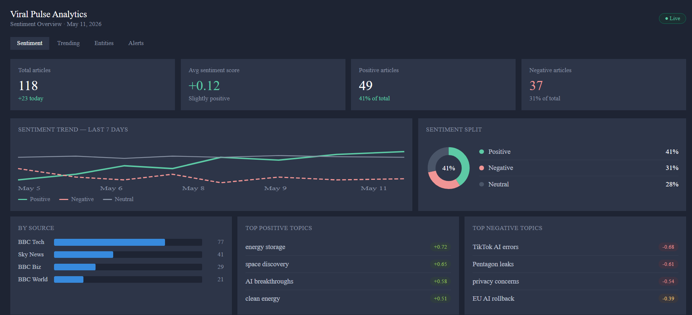
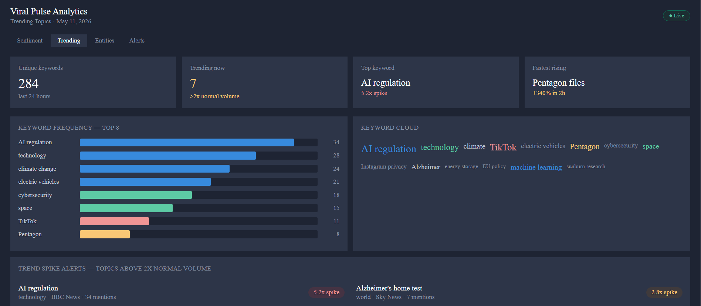

# 🔥 Viral Pulse — Social Media Sentiment & Trend Intelligence Dashboard
## Dashboard Screenshots







> **End-to-end NLP analytics pipeline** that tracks Reddit posts, extracts sentiment, detects emerging trends, stores insights in PostgreSQL, and visualizes everything in a live Power BI dashboard.

---

## 📸 Project Overview

```
Reddit API + RSS Feeds
        ↓
  Python NLP Pipeline
  (VADER + spaCy + Keyword Extraction)
        ↓
  PostgreSQL Database
  (4 normalized tables)
        ↓
  Power BI Dashboard
  (4 report pages, auto-refresh)
```

---

## 🚀 Key Features

| Feature | Tech Used |
|---|---|
| Automated data ingestion every hour | `PRAW` (Reddit API) + `APScheduler` |
| Sentiment analysis (pos/neg/neutral) | `VADER SentimentIntensityAnalyzer` |
| Named entity extraction (brands, people) | `spaCy en_core_web_sm` |
| Keyword trend detection vs 7-day avg | `PostgreSQL window functions` |
| Trend spike alerts (>2x normal volume) | SQL + Python alerting logic |
| Live Power BI dashboard | DirectQuery + PostgreSQL connector |

---

## 📁 Project Structure

```
viral_pulse/
├── src/
│   ├── ingestion/
│   │   ├── reddit_collector.py      # Pulls posts from Reddit API
│   │   └── rss_collector.py         # Pulls news via RSS feeds
│   ├── nlp/
│   │   ├── sentiment.py             # VADER sentiment scoring
│   │   ├── entities.py              # spaCy NER extraction
│   │   └── keywords.py              # TF-IDF keyword extraction
│   ├── database/
│   │   ├── connection.py            # PostgreSQL connection pool
│   │   └── writer.py                # Batch insert helpers
│   └── scheduler/
│       └── pipeline.py              # APScheduler hourly job
├── sql/
│   ├── 01_schema.sql                # Create all tables
│   ├── 02_trending_view.sql         # Trending keywords view
│   └── 03_sample_queries.sql        # Power BI query templates
├── notebooks/
│   └── exploration.ipynb            # EDA + prototype analysis
├── dashboard/
│   └── POWERBI_SETUP.md             # Step-by-step Power BI guide
├── tests/
│   └── test_pipeline.py             # Unit tests
├── .env.example                     # Environment variables template
├── requirements.txt                 # Python dependencies
└── README.md
```

---

## ⚡ Quick Start

### 1. Clone & Install
```bash
git clone https://github.com/YOUR_USERNAME/viral-pulse.git
cd viral-pulse
pip install -r requirements.txt
python -m spacy download en_core_web_sm
```

### 2. Set Up Environment
```bash
cp .env.example .env
# Fill in your Reddit API credentials and PostgreSQL connection string
```

### 3. Set Up Database
```bash
psql -U postgres -d viral_pulse -f sql/01_schema.sql
psql -U postgres -d viral_pulse -f sql/02_trending_view.sql
```

### 4. Run the Pipeline
```bash
python src/scheduler/pipeline.py
```

### 5. Connect Power BI
See `dashboard/POWERBI_SETUP.md` for the full walkthrough.

---

## 📊 Dashboard Pages

1. **Sentiment Overview** — Real-time pos/neg/neutral split with trend line
2. **Trending Topics** — Keyword frequency over time by subreddit  
3. **Entity Intelligence** — Which brands/people are surging in mentions
4. **Trend Alerts** — Topics spiking >2x their 7-day rolling average

---

## 🔑 Key Findings

> *(Fill this in after running the pipeline for a week — this section impresses recruiters)*

- Example: *"r/technology posts mentioning 'AI' spiked 340% in the week following GPT-4 launch"*
- Example: *"Negative sentiment toward Brand X peaked on Tuesdays, correlating with weekly product update announcements"*

---

## 🛠️ Tech Stack

`Python 3.11` · `PRAW` · `spaCy` · `VADER` · `scikit-learn` · `SQLAlchemy` · `PostgreSQL` · `APScheduler` · `Power BI`

---

## 📄 License

MIT — free to use and adapt for your own portfolio.
